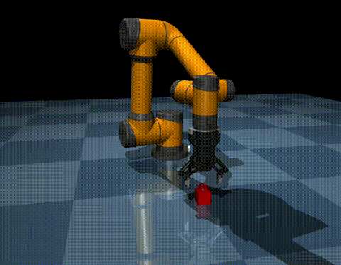
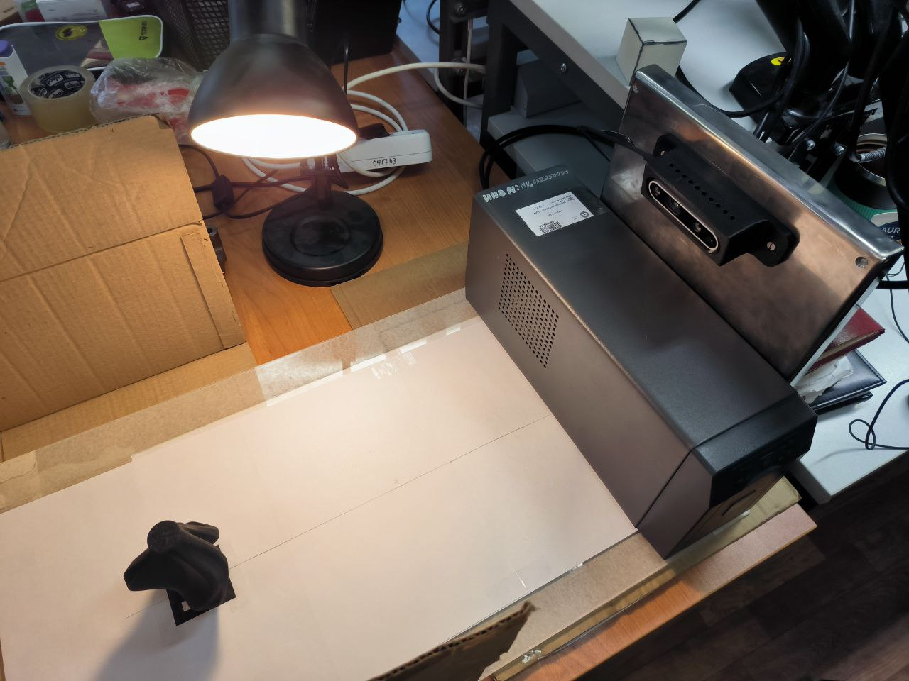
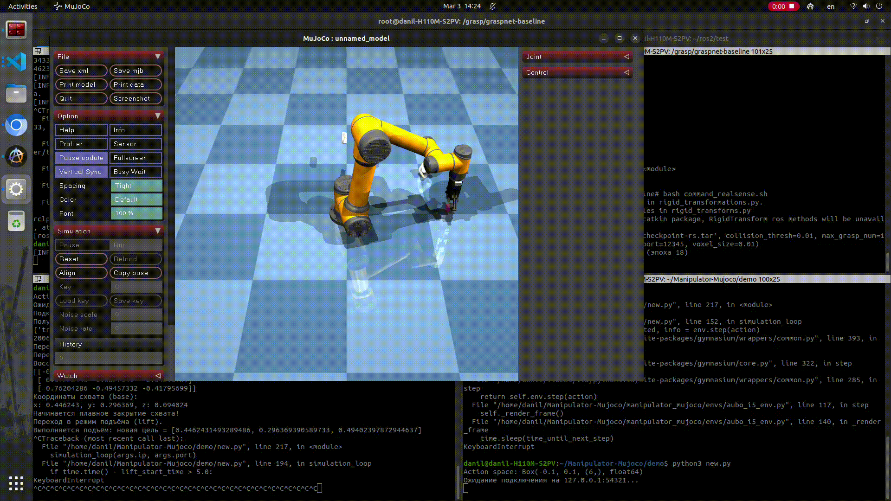

# Manipulator-Mujoco

<p float="left">

</p>

## Оглавление

- [Цель](#цель)
- [Описание репозитория](#описание-репозитория)
- [Описание эксперимента](#описание-эксперимента)
- [Поддерживаемые роботы](#поддерживаемые-роботы)
- [Установка](#установка)
- [Демонстрационные примеры](#демонстрационные-примеры)
- [Настройка собственного окружения](#настройка-собственного-окружения)

## Описание репозитория

<div style="text-align: justify;">
Manipulator-Mujoco — это шаблонный репозиторий, который упрощает настройку и управление манипуляторами в Mujoco. Он предоставляет универсальный контроллер операционного пространства, способный работать с любым манипулятор. Репозиторий включает базовое окружение Gymnasium, которое можно адаптировать под задачи обучения с подкреплением. Проект построен с использованием dm_control, что обеспечивает лёгкую конфигурацию для различных окружений Mujoco.
</div>

## Описание эксперимента

- [Оглавление](#оглавление)

<div style="text-align: justify;">
Эксперимент демонстрирует полный цикл работы манипулятора в симуляции Mujoco с обменом данными через сеть. Он объединяет управление роботом, приём внешней команды и реалистичное моделирование захвата объекта. 
</div><br />

Для запуска симуляции необходимо запустить следующий скрипт:

```bash
cd lab_1.2/

bash diff.sh
```

В другом терминале необходимо запустить следующий скрипт:
```bash
cd lab_1.2/

bash rviz.sh
```

Для изменения объекта вызываем другой [скрипт](./vase.sh). Также в [скрипте](./rviz.sh) вносим изменения режима (MODE). Для выбора другого набора данных изменяем номер .json [файла](./src/my_tf_broadcaster/my_tf_broadcaster/test.py).


### Основные этапы эксперимента:

1. Инициализация симуляции

<div style="text-align: justify;">
Создаётся симуляционное окружение с визуализацией, в котором настраиваются основные параметры робота (например, идентификатор привода захвата). До получения внешней команды робот выполняет случайные действия, что позволяет задать базовое поведение.
</div><br />

2. Приём внешней команды захвата

<div style="text-align: justify;">
Отдельный поток открывает TCP-сокет (на 127.0.0.1:54321) и ожидает подключения. После установления соединения симуляция получает JSON-сообщение с данными позиции и ориентации целевого объекта. Эти данные используются для обновления целевой позиции (mocap target) в симуляции.
</div><br />

3. Пошаговая логика выполнения захвата

<div style="text-align: justify;">
После получения внешней команды робот последовательно переходит через следующие этапы:
</div> <br />

I. Подход к объекту 
<br />
<div style="text-align: justify;">
Цель сначала смещается по оси Z для обеспечения безопасного приближения.
</div> <br />

II. Финальное позиционирование 

<div style="text-align: justify;">
После ожидания манипулятор переводится в окончательное положение захвата, где происходит дополнительная проверка ориентации (с использованием преобразования кватерниона в матрицу вращения).
</div> <br />

III. Захват

<div style="text-align: justify;">
Запускается процесс плавного закрытия захватного устройства, что имитирует реальное действие захвата.
</div><br />

IV. Подъем объекта 

После закрытия схвата робот поднимает объект, завершая цикл захвата.

4. Интеграция с внешними системами

<div style="text-align: justify;">
Эксперимент разработан так, чтобы его можно было легко интегрировать с ROS2 (для трансляции TF-преобразований) и с нейронными сетями (например, GraspNet, обрабатывающей данные RealSense). Это позволяет протестировать цепочку от восприятия объекта до его захвата и подъёма.
</div><br />

<div style="text-align: justify;">
На рисунке и гифке продемонстрирована отработка завата объекта с помощью данного репозитория.
<p float="left">
</div><br />


</p>


## Поддерживаемые роботы

- [Оглавление](#оглавление)

В настоящее время в репозитории поддерживаются следующие роботизированные манипуляторы и захваты:

### Манипуляторы
1. Aubo i5
2. UR5e

### Захватные устройства
1. DH Robotics AG95

## Установка

- [Оглавление](#оглавление)

Чтобы начать работу, выполните следующие шаги для установки репозитория:

1. Склонируйте репозиторий на свой компьютер:

   ```bash
   git clone git@github.com:dakolzin/MuJoCo-test.git
   ```

2. Перейдите в корневую директорию репозитория:

   ```bash
   cd lab_1.2
   ```

3. Установите репозиторий в режиме editable:

   ```bash
   pip install -e .
   ```

## Демонстрационные примеры

- [Оглавление](#оглавление)

Изучите возможности Manipulator-Mujoco с помощью демонстрационных примеров, расположенных в папке [my_sim](./my_sim).

### Aubo i5 с AG95 захватом

Чтобы запустить демонстрацию для Aubo i5 с AG95 захватом, выполните:

```bash
cd lab_1.2/my_sim/old/

python aubo_i5_demo.py
```

<div style="text-align: justify;">
В демонстрационных примерах можно управлять манипулятором: двойной клик выделяет целевой красный объект mocap, удерживая клавишу Ctrl и используя левую кнопку мыши для поворота или правую для перемещения. Манипулятор будет использовать операционное управление пространством для следования за целевым объектом mocap.
</div>

## Настройка собственного окружения

- [Оглавление](#оглавление)

Если вы хотите создать собственное окружение, следуйте структуре, определённой в manipulator_mujoco/envs. Ниже приведён упрощённый пример настройки окружения:

```python
# создание сцены с шахматным покрытием пола
self._arena = StandardArena()

# создание целевого объекта mocap, за которым будет следить OSC
self._target = Target(self._arena.mjcf_model)

# роботизированный манипулятор UR5e
self._arm = Arm(
    xml_path=os.path.join(
        os.path.dirname(__file__),
        '../assets/robots/ur5e/ur5e.xml',
    ),
    eef_site_name='eef_site',
    attachment_site_name='attachment_site'
)

# присоединение манипуялтора к сцене
self._arena.attach(
    self._arm.mjcf_model, pos=[0, 0, 0], quat=[0.7071068, 0, 0, -0.7071068]
)

self._physics = mjcf.Physics.from_mjcf_model(self._arena.mjcf_model)
```

Настройка операционного управления пространством разработана максимально просто:

```python
# настройка контроллера OSC
self._controller = OperationalSpaceController(
    physics=self._physics,
    joints=self._arm.joints,
    eef_site=self._arm.eef_site,
    min_effort=-150.0,
    max_effort=150.0,
    kp=200,
    ko=200,
    kv=50,
    vmax_xyz=1.0,
    vmax_abg=2.0,
)
```

Перед вызовом physics.step() просто вычислите целевую точку и запустите контроллер OSC для перемещения к ней:

```python
target_pose = calculate_target_pose_for_OSC()  # [x, y, z, qx, qy, qz, qw]

# запуск контроллера OSC для перемещения к целевой позе
self._controller.run(target_pose)

# выполнение шага физики
self._physics.step()
```

<div style="text-align: justify;">
Классы OperationalSpaceController и Arm берут на себя детали отслеживания идентификаторов элементов mjcf, что избавляет от необходимости явно указывать имена суставов или двигателей. Они должны без проблем работать с любой моделью роботизированного манипулятора, включая различные типы суставов, при условии удаления двигателей из модели, так как контроллер автоматически применяет к каждому суставу необходимые усилия.
</div>

## Запуск системы визуализации захвата объекта

- [Оглавление](#оглавление)

Для запуска необходимо выполнить следующие команды. 

1. **Перейти в папку lab_1.2**:

```bash
cd lab_1.2
```

**Запустить bash-скрипт:**

```bash
. rviz.sh
```
2. **В другом терминале перейти в [my_sim](./my_sim)**:
```bash
cd lab_1.2o/my_sim
```
**Запустить один из скриптов:**
```bash
python3 vase.py

#или

python3 diff.py
```

## Благодарности

Особая благодарность Ian Chuang за разработку репозитория [Manipulator-Mujoco](https://github.com/ian-chuang/Manipulator-Mujoco), который послужил важной основой для данной симуляции.

---